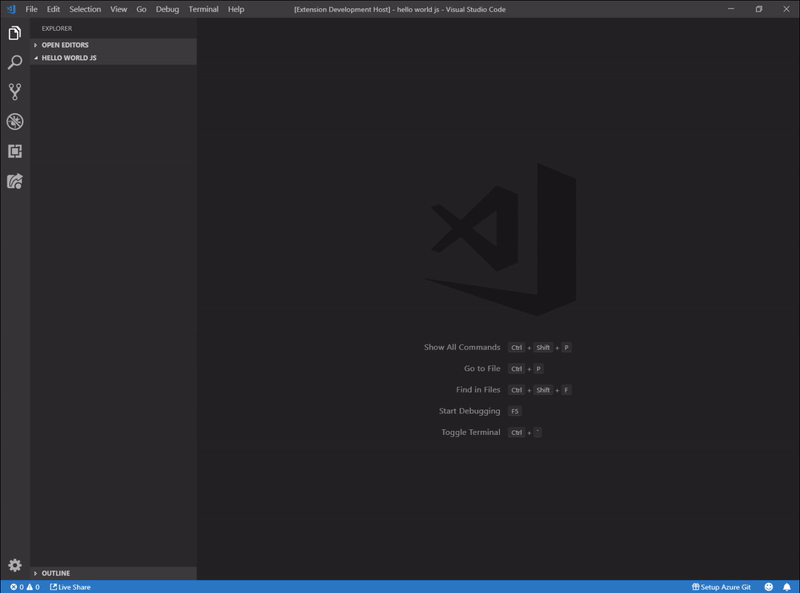
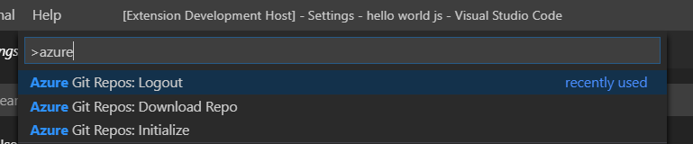
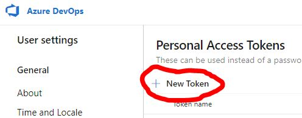
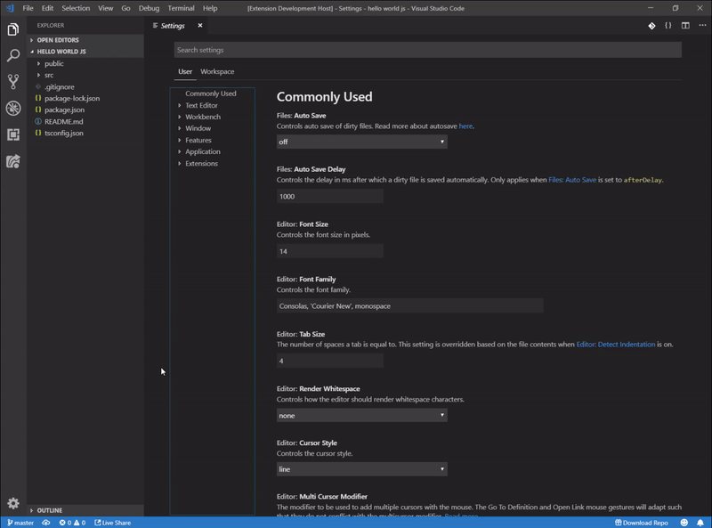
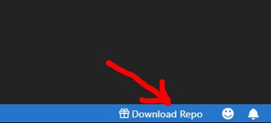

# Git Repos Extension

This is a VS Code extension to easily download your Git Repos and Projects from the Command Palette. One of the most frustrating parts of downloading your Git code is remembering those pesky remote URLS. This extension makes it so you never have to memorize a URL again! Only supports Git projects hosted in Azure DevOps.

## Features

To setup the extension start by adding your Organization name and Personal Access Token generated from Azure DevOps. The token only needs access to read Code. After that you can browse your project names and repos from inside VS Code.

> Tip: You can also access all of the commands from the Command Palette starting with the name 'Git Repos'

* Initialize - Set Org and Personal Access Token
* Download Repo - Displays projects picker to download from repo
* Logout - Clears the Org and PAT

Generate your Personal Access Token from your Azure DevOps site

## Extension Settings

You can customize the extension from the User Settings in VSCode

Allows you to customize what terminal commands run when downloading from a repo

* `azuregit.settings.command1` 
* `azuregit.settings.command2` 
* `azuregit.settings.command3` 

Set whether you want the Download Repo button to appear at the bottom of VS Code

* `azuregit.settings.showStatusBar`

## Requirements

> Requires running VS Code version 1.28.0 or later
